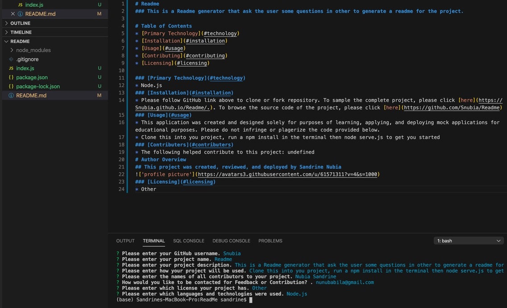

# Readme

### This is a Readme generator that ask the user some questions in other to generate a readme for the project.

# Table of Contents

- [Primary Technology](#technology)
- [Installation](#installation)
- [Usage](#usage)
- [Contributing](#contributing)
- [Licensing](#licensing)

### [Primary Technology](#technology)

- Node.js

### [Installation](#installation)

- Please follow GitHub link above to clone or fork repository. To sample the complete project, please click [here](https://Snubia.github.io/Readme/.). To browse the source code of the project, please click [here](https://github.com/Snubia/Readme)

### [Usage](#usage)

- This application was created and designed solely for purposes of learning, applying, and deploying mock applications for educational purposes. Please do not infringe or plagerize the code provided below.
- Clone this into you project, run a npm install in the terminal then node serve.js to get you started

### [Contributers](#contributers)

- The following helped contribute to this project: undefined

# Author Overview

## This project was created, reviewed, and deployed by Sandrine Nubia

### [Licensing](#licensing)

- Other

### Demo

- This Readme was made using the generator
  
